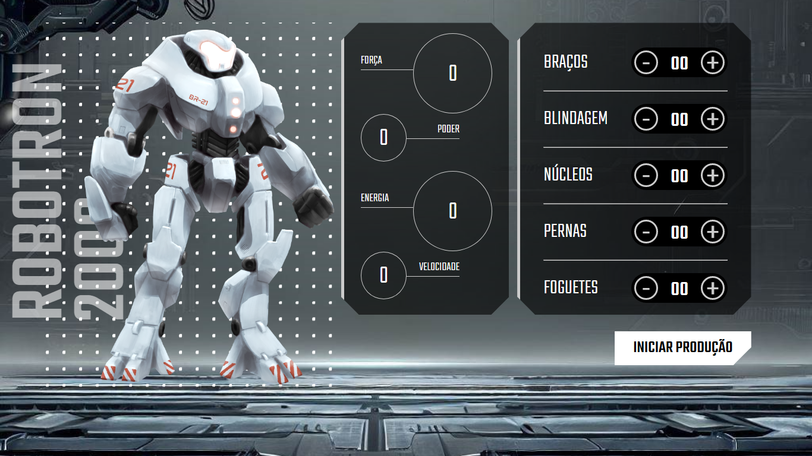

# Robotron 2000
Projeto feito a partir de curso da formação JavaScript da Alura.

  
# Robotron 2000

Página Web criada com base em treinamento de JavaScript da Alura, de uma página inicial de jogo onde o usuário escolhe um robô e suas características.

## 🔨 Funcionalidades do projeto

Página Web criada com base em treinamento de JavaScript da Alura, de uma página inicial de jogo onde o usuário escolhe um robô e suas características.

## ✔️ Técnicas e tecnologias utilizadas

- `Funcionalidade 1`: HTML. Linguagem de marcação..
- `Funcionalidade 2`: CSS. Linguagem para estilização do html.
- `Funcionalidade 3`: Javascript. Linguagem de programação.

## 📁 Acesso ao projeto

[Clique aqui para acessar](https://ericksilverio00.github.io/AluraMidi/)

## 🛠️ Abrir e rodar o projeto

Para abrir e rodar o projeto basta clicar nos ícones de navegação.

## 📚 Mais informações do curso

Mais um projeto realizado a partir da trilha frontend da alura. Recomendo de olhos fechados a plataforma, que está me fazendo evoluir de maneira meteórica.
